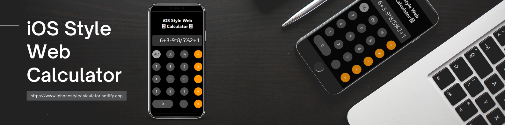

# iPhone Style Calculator 📱

 <!-- Replace with your header image URL -->

Welcome to the **iPhone Style Calculator**! This project replicates the sleek and minimalistic design of the official Apple iPhone calculator using **HTML**, **CSS**, and **JavaScript**. The calculator is fully responsive and offers a seamless user experience.

🌐 **Live Demo:** [iphonestylecalculator.app](https://iphonestylecalculator.netlify.app)

## 🚀 Features

- **iPhone-Inspired UI:** A faithful recreation of the Apple iPhone's calculator interface.
- **Responsive Design:** Works perfectly on both desktop and mobile devices.
- **Smooth Animations:** Engaging transitions for a better user experience.
- **Full Functionality:** Supports basic arithmetic operations like addition, subtraction, multiplication, and division.

## 🛠️ Skills Used

-  **HTML5**
-  **CSS3**
-  **JavaScript**
-  **Git & GitHub**
-  [Netlify](https://app.netlify.com)  **for Deployment**

## 📂 Project Structure

```
├── index.html    # Main HTML  structure file
├── style.css     # CSS file for styling UI
├── script.js     # JavaScript for functionality
└── README.md     # This README file
```

## 🌟 Getting Started

To run the project locally:

1. Clone the repository:
   ```bash
   git clone https://github.com/your-username/your-repository.git
2. Navigate to the project directory:
   ```bash
   cd your-repository
3. Open index.html in your favorite browser.
<hr>

# ✨ Live Deployment
The project is live and hosted on Netlify. You can check it out here. [iphonestylecalculator.app](https://iphonestylecalculator.netlify.app)

# 🙏 Acknowledgements
Inspired by the official Apple iPhone Calculator design.
Deployed using [Netlify](https://app.netlify.com).

# 📫 Contact
For any inquiries or feedback, feel free to reach out
via [Email](mailto:preetsidhu2549@gmail.com) or through [LinkedIn](https://www.linkedin.com/in/manpreetsindhsidhu) or through [my GitHub](https://github.com/manpreetsidhhu).

🔗 View on [GitHub](https://github.com/manpreetsidhhu/iosStyleCalculator).
